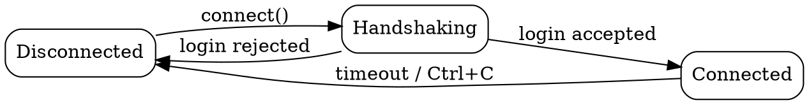

# Graphviz DOT Diagrams

Renders locally via the `dot` CLI (already installed — confirmed `graphviz 15.1.1`). There is no MCP live-preview server for Graphviz in this project, unlike [`.skills/mermaid-diagrams`](../mermaid-diagrams/SKILL.md); the workflow here is file-based.

## When DOT, when Mermaid

Default to `.skills/mermaid-diagrams` for flowcharts, sequence diagrams, class/ER diagrams, and simple state diagrams — it renders inline in GitHub and Artifacts with no local tooling.

Reach for DOT instead when:
- The graph is large or densely connected (dependency trees, call graphs, module/packet-type relationships) and needs a real layout algorithm rather than Mermaid's fixed heuristics.
- You need a specific layout engine — spring-model (`neato`), force-directed for large graphs (`fdp`/`sfdp`), circular (`circo`), or radial (`twopi`) — instead of `dot`'s default top-to-bottom hierarchy.
- Fine-grained edge routing, ranks, or record-shaped nodes matter more than portability.

## Core Workflow

1. Write the graph to a `.dot` file (don't inline DOT source into chat — render it).
2. Render with the appropriate engine (see table below) to SVG for viewing, PNG if a raster image is needed:
   ```bash
   dot -Tsvg diagram.dot -o diagram.svg
   ```
3. Open it for a visual check before treating the diagram as final:
   ```bash
   open diagram.svg   # macOS
   ```
4. Save finished diagrams under `docs/diagrams/` (create it if it doesn't exist) so they're referenced consistently from markdown docs, e.g. ``.

There's no live-reload for DOT the way Mermaid has — re-run step 2 after each edit and re-open, or use `dot -Tsvg diagram.dot -o diagram.svg && open diagram.svg` as one command while iterating.

## Layout Engines

| Engine | Best for | Command |
|---|---|---|
| `dot` (default) | Hierarchical graphs: dependency trees, call graphs, org charts | `dot -Tsvg g.dot -o g.svg` |
| `neato` | General undirected graphs, spring-model layout | `neato -Tsvg g.dot -o g.svg` |
| `fdp` | Force-directed, medium-sized graphs | `fdp -Tsvg g.dot -o g.svg` |
| `sfdp` | Force-directed, large graphs (thousands of nodes) | `sfdp -Tsvg g.dot -o g.svg` |
| `circo` | Circular layout — ring/cyclic structures | `circo -Tsvg g.dot -o g.svg` |
| `twopi` | Radial layout — one central node, others radiate out | `twopi -Tsvg g.dot -o g.svg` |

## Syntax Essentials



- `digraph` for directed graphs (`->` edges), `graph` for undirected (`--` edges) — don't mix edge operators with the wrong graph type, it's a syntax error.
- Node IDs with spaces or punctuation need quotes: `"API Gateway" [label="API"];` — or just use an underscore ID with a separate `label` attribute, which avoids the quoting question entirely.
- Attribute lists are comma-separated: `node [shape=box, color=red];` (a missing comma silently drops the second attribute rather than erroring).
- Clusters must be named with a `cluster_` prefix (`subgraph cluster_auth { ... }`) or Graphviz won't draw them as a bounded box.
- `rankdir=LR|TB|RL|BT` controls overall flow direction; default is top-to-bottom (`TB`).

## Common Pitfalls

| Symptom | Fix |
|---|---|
| Nodes overlapping | Increase `nodesep` (horizontal) / `ranksep` (vertical) on the graph |
| Layout looks wrong for the data | Try a different engine (see table) rather than fighting `dot`'s hierarchy |
| Edges crossing too much | `splines=ortho`, or reorder node declarations to hint rank order |
| Subgraph not drawn as a box | Rename it to start with `cluster_` |
| Attribute silently ignored | Check for a missing comma in the attribute list |
