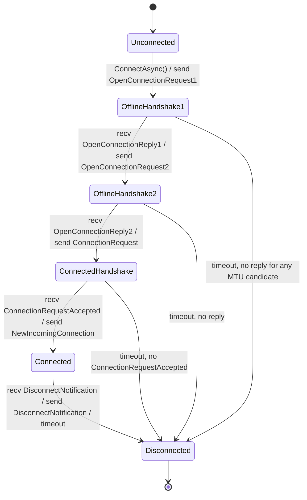
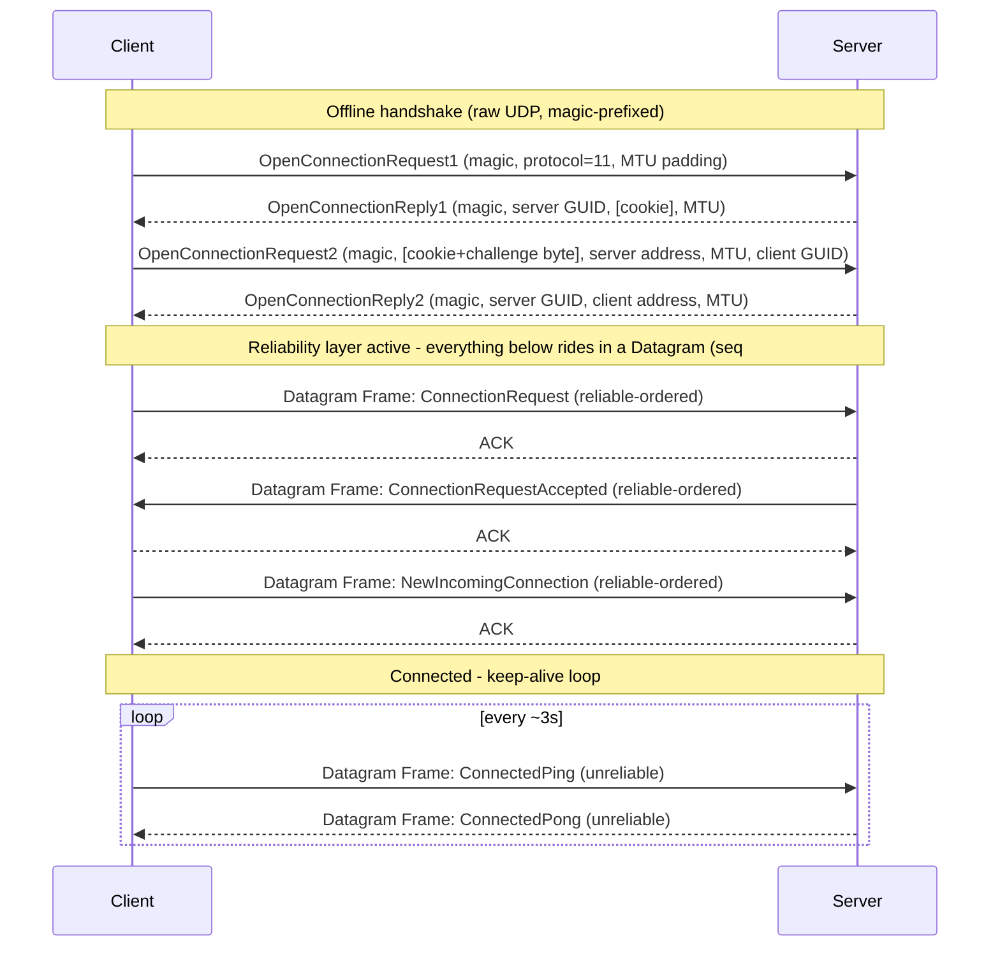

# RakNet connection state machine

Pattern: explicit `ConnectionState` enum + a guarded `TransitionTo` method, not a class per state.

Why: the lifecycle is linear — five states, each transient state waiting on exactly one specific packet. GoF's per-state polymorphism pays off when states genuinely differ in *how* they handle the *same* operation; here they differ only in *which single packet* they're waiting for. A `switch` inside a guarded transition does that in a few lines, and matches this project's existing bias against premature abstraction. It's still the State pattern in spirit — explicit named states, illegal transitions throw — just the enum-driven variant instead of five classes each needing a back-reference into shared connection state (message-index counters, the resend cache).

Revisit if a later milestone adds a state with real independent behavior or fields of its own (e.g. a resumable reconnect state with its own retry policy) — that's the point a class-per-state starts paying for itself.

Implemented in [`Networking/RakNet/RakNetConnection.cs`](../../BedrockConsoleClient/Networking/RakNet/RakNetConnection.cs) (`TransitionTo`, `s_legalTransitions`) and [`ConnectionState.cs`](../../BedrockConsoleClient/Networking/RakNet/ConnectionState.cs).

No Strategy-pattern abstraction for the connect flow itself (offline mode vs. future Xbox Live vs. Realms) — only one implementation exists today, so an `IConnectFlow` interface would be premature. Revisit at Milestone 2, when a second flow actually exists to abstract over.

## Diagrams

## Protocol details verified against reference implementations

The initial plan for this milestone flagged several byte-layout details as unverified (frame length in bits vs. bytes, field endianness, address XOR encoding, system-address list count, disconnect packet ID). All were resolved by reading two real implementations rather than guessing:

- [`sandertv/go-raknet`](https://github.com/sandertv/go-raknet) (Go) — a modern, actively maintained RakNet client. Confirmed: frame length is encoded in *bits* (`length << 3`); the 24-bit fields (datagram sequence number, message/order/sequence index) are little-endian while everything else is big-endian; RakNet wire addresses bit-flip each IPv4 octet (`~octet`); `ConnectionRequestAccepted`/`NewIncomingConnection` nominally carry 20 system-address slots but real servers send fewer, so decoding must stop by remaining-length, not a hardcoded count; `DisconnectNotification` is `0x15`.
- [`pmmp/RakLib`](https://github.com/pmmp/RakLib) (PHP) — the RakNet implementation the local PocketMine-MP test server actually runs. This surfaced two details go-raknet's newer protocol variant has that RakLib does not implement the same way:
  - **Anti-amplification cookie**: `OpenConnectionReply1` may carry a `HasSecurity` flag + 4-byte cookie; if present, the client must echo it back in `OpenConnectionRequest2`.
  - **The cookie region is 5 bytes, not 4**: RakLib always reads a cookie (4 bytes) *plus* a 1-byte "encryption challenge" placeholder immediately after it, detected by the packet's remaining length rather than a flag. Sending only the bare 4-byte cookie desyncs every field after it by one byte — this was the actual bug caught during implementation (see below).

## A real bug this caught

The first implementation of `OpenConnectionReply1.Decode`/`OpenConnectionReply2.Decode` never skipped the 16-byte magic prefix before reading fields, so `ServerGuid`/`ServerHasSecurity`/`Cookie` were read out of the magic bytes themselves. The tell: the decoded cookie value was `0xFDFDFD12` — visibly a slice of the magic sequence (`...FD FD FD FD 12 34 56 78`), not a real cookie. Caught by hex-dumping the actual outgoing `OpenConnectionRequest2` packet and cross-checking field-by-field against RakLib's parser, not by static reasoning. Fixed alongside the 5-byte cookie-region bug above; see git history for both.

## Confirmed empirically: PocketMine-MP enforces a login-completion timeout

One of the plan's open questions was whether a RakNet-only session (no Bedrock `Login` packet ever sent) survives indefinitely. It does not: PocketMine-MP closes the session exactly 10 seconds after `Session opened`, logged as `Session closed: Login timeout`, regardless of a healthy `ConnectedPing`/`ConnectedPong` exchange in the meantime. Reproduced twice with matching timing. This is expected, not a bug in this slice — see the Definition of Done in the milestone plan: this slice's bar is reaching `Connected` and proving at least one keep-alive round trip, not staying up forever. Indefinite idling is Milestone 1's *full* bar (RakNet + partial Bedrock login together), which is out of scope here.
